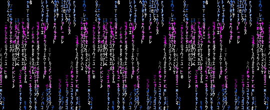

  
  <h1>Hi, I'm Naich Naznafi 👋</h1>
  

    <em>Mechanical Engineering Student | Innovative Python Developer | AI Art Creator - Midjourney | Graphics Designer - Photoshop & Illustrator | Custom Software Developer - Automation | Tech Enthusiast - Prompt Engineer</em>
  

  

    
    
  

---

### About Me

I'm a Mechanical Engineering student with a diverse skill set that spans multiple domains. My passions include:

- **Python Development**: Crafting innovative solutions and automation tools.
- **AI Art Creation**: Utilizing Midjourney to generate stunning AI art.
- **Graphic Design**: Proficient with Photoshop and Illustrator to create captivating designs.
- **Custom Software Development**: Building tailored software solutions for various needs.
- **Tech Enthusiasm**: Constantly exploring new technologies and enhancing my prompt engineering skills.

---

  

---

### Let's Connect

  
  
  

---

  
Thanks for stopping by! 😄

